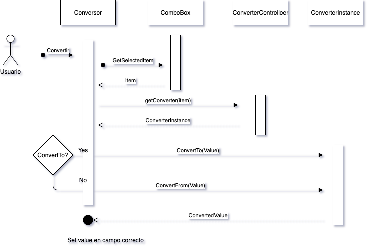

# Programacion Avanzada TP1 - Conversor Generico

## Requerimnientos

* Contener al menor 5 tipos de conversores. Pueden incluir los dos vistos en clase.
* Dos TextFields, con UN solo botón para convertir.
* Presionando <ENTER> sobre los TextFields, debe convertir.
* No contener código repetido, esto es reutilizar sentencias de código que se necesitan en eventos diferentes.
* Manejo de error con Exceptions (ej.: NumberFormatException), mostrando un mensaje amigable via JOptionPane.
* Si se ingresa la ',' (coma) como separador decimal, que se realice la conversión.
* Además de estas reglas funcionales, recuerden basarse en lo hecho en clase, terniendo en cuenta el uso de la Herencia y el Polimorfismo.

## Solucion

`Conversor` y `ConverterController` trabajan en conjunto para cumplir con lo solicitado. 

Dentro de `Conversor` intentamos manejar cuestiones relacionadas a la vista y acciones hechas por el usuario. Dentro de `ConverterController` intentamos manejar cuestiones relacionadas a los "Converter especificos" que podemos ofrecer. 

### Flujo del programa al convertir

Para desarrollar decidimos armar un pequeño diagrama que permita entender el mejor flujo del mismo. Se presenta a modo informativo. 

